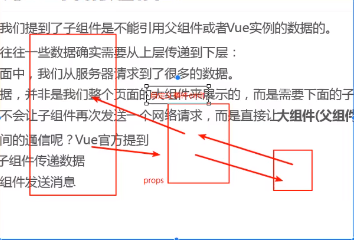
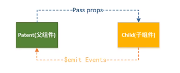
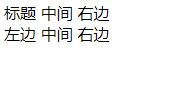
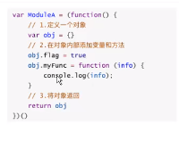

# vue
>## 一.MVVM
>## 二.初识vue
### 选项options/生命周期钩子
#### 1.el：挂载点,data(组件当中必须是函数),,methos
```vue
//message 要在挂载点元素内
<div id="app">
{{message}}
<span>{{message}}</span>
</div>

<script>
var one=new Vue({
    el:'#app',
    data:{
           message:'nihao',
           arry:[],
           obj:{}
    }
    methos{}
})
</script>

```
#### 2.data数据对象
- vue中的数据可以定义在data中，data可以写复杂类型数据,渲染复杂类型的数据遵循js语法
- 数组对象的引用xuesheng.name
- 数组的引用diqu[0]
```vue
<div id="app">
{{message}}
{{xuesheng.name}},{{xuesheng.age}}
{{diqu[0]}}
</div>
var one=new Vue({
    el:'#app',
    data:{
           message:'学生',
          xuesheng:{
              xuehao:002,
              name:tom,
              school:hk,
              age:18

          diqu:[01,02,03,04,05]        
 

          }
           obj:{}
    }
  
})
```
##### Mustache语法{{}}
- Mustache:胡子/胡须
>## 三.Es6语法
#### 1.let/var/const
- const  (使用时必须先赋值，常量不可以被修改)
- const常量的含义是指向对象不能修改，但是可以改变对象内容的属性
```javascipt
const obj={
    name='xiaoming',
    age=18
}
     obj.name='xiaohong';//对象内容的属性可以修改即obj指向的内存地址没有变
     obj.age=20
```
- 建议：在ES6开发中优先使用const只有需要改变某一个标识符的时候才使用let  (swift- let/var)
#### 2.对象的字面量增强写法
- 对象的字面量：
```javascipt

//const obj = new Object{}
const obj={
        //{}即对象的字面量
}
```
- 对象的字面量增强写法：
```javascipt
const name='xiaoming';
const age= 20;

//Es5写法
const obj={
    name=name,
    age=age,
    run:function(){

    }
}
//Es6写法
const obj={
    name,
    age,
    run(){

    }
}


```


#### 3.箭头函数  ()=>{}
>## 四.vue生命周期
####  vue生命周期


>## 六.vue指令
#### 1.内容绑定，事件绑定（v-text,v-html,v-on基础）
##### (1)v-text(设置标签的内容，设置插值表达式{{}}可以替换指定·内容)
- 支持行类字符串的拼接
```vue
<div id="app">
<p v-text='message+"nihao"'>这里的内容失效<p>
<p>{{message+"nihao"}}这里的内容有效</p>
</div>
var one=new Vue({
    el:'#app',
    data:{
           message:'学生'     
    }
  
})
```
#### (2)v-html
- 设置文本或者标签的innerHtml
```vue
<div id="app">
<p v-text='message+"nihao"'>这里的内容失效<p>
<p>{{message+"nihao"}}这里的内容有效</p>
</div>
var one=new Vue({
    el:'#app',
    data:{
           message:'<p>你好</p>'     
    }
  
})
```
#### (2)v-on
- <h6 style="color:red">通过this关键字可以访问定义在data中的数据</h6>
- 为元素绑定事件
- 方法定义在method中
- 应用案例计数器

```vue
//<input v-on:事件名='方法'>
/<input @事件名='方法'>

<div id="app">
    <p v-html="message+'你好呀'">没有效果</p>
    <p v-on:click='fangfa'>fangfa<p>
    <p @mouseenter='fangfa'></p>
</div>
var one=new Vue({
    el:'#app',
    data:{
           message:'<p>你好</p>'     
    },
    methods:{
        fangfa:function(){
            this.message="<p>信息改变了</p>"
        }，
        fangfa2:function(){
            this.message+="<p>增加一条信息</p>"
        }
    }
})
```

#### 2.显示切换，属性绑定（v-show,v-if,v-bind）
##### (1)v-show 显示隐藏状态
- 根据表达式的真值，切换元素的隐藏和显示
- true是显示，false隐藏

```vue
//<input v-on:事件名='方法'>
//<input @事件名='方法'>

<div id="app1">
        <p v-show='true'>内容</p>
        <p v-show='kongzhi'>内容</p>
        <button @click='show1' v-html='message'></button>
</div>
var one1=new Vue({
    el:'#app1',
    data:{
           message:'隐藏内容',
           kongzhi:true
                
    },
    methods:{
           show1:function(){
               if(this.kongzhi==false)
               {
                this.kongzhi=true;
               this.message='隐藏内容';
               }
              

               else{
                this.kongzhi=false;
                this.message='显示内容'
               }
           }
    }
})
```  
##### (2)v-if 满足显示状态渲染（v-else/v-else-if）
- 根据表达式的真值，切换元素的隐藏和显示(直接操作Dom元素)
- v-show：display:none
- 隐藏即从Dom树中移出，显示即添加到Dom树中
- 频繁切换用v-show反之则用v-if(操作Dom树对性能消耗大)
```vue
//v-if与v-else-if联合使用

<div id="app7">
          <p v-if='true'>内容</p>
          <!-- v-if会移出dom；v-show：display:none -->
          <p v-if='kongzhi'>内容</p>
          <!-- <p v-show='kongzhi'>内容</p> -->
          <!-- 必须要写到对应的v-if下面才会生效 -->
          <p v-else>v-if为flase显示我</p>
          <!-- <p v-else-if='num>80'>num大于80为flase显示我</p> -->
          <button @click='show1' v-html='message'></button>
          
  </div>

<srcipt>

// v-if和v-else的联合使用
const one7=new Vue({
    el:'#app7',
    data:{
           message:'隐藏内容',
           kongzhi:true,
           num:78
    },
    methods:{
           show1(){
               if(this.kongzhi==false)
               {
                this.kongzhi=true;
               this.message='隐藏内容';
               }
              

               else{
                this.kongzhi=false;
                this.message='显示内容'
               }
           }
    }
})

</srcipt>
```  
##### (3)v-bind 设置元素属性（src,class,title）
- v-bind:属性名=表达式
- 书写时可省略如:v-bind:class='nihao'和:class='nihao'一样

```vue
//<input v-bind:class='nihao'>
//<input :class='nihao'>

<!-- 添加移出类     -->
<div id="app1">
    <p v-bind:class='Tclass'>内容</p>
<!-- 三元运算符     -->
    <p :class='Bclass?Aclass:""'>内容</p>
<!-- 对象的写法,判断:后是否为真，如果为真就生效 -->
    <p :class='{"我是添加的类名":Bclass}'>内容</p>
    <button @click='show1' v-html='message'></button>
</div>
<script>

var one1=new Vue({
        el:'#app1',
        data:{
               message:'添加类',
               Aclass:'我是添加的类名',
               Bclass:false
                    
        },
methods:{
     show1:function(){
          if(this.Bclass==true)
             {

              this.Bclass=false;
              this.message='添加类';
          }
       else{
              this.Bclass=true;
              this.message='移出类'
                   }
               }
        }
    })
</script>
``` 
><h6 style="color:red">案例:轮播图；总结：Jquery与vue的区别：（1）Jquery是操作dom树改变标签的显示与隐藏（或者插入和移出）（或者改变图片透明度），（2）而vue中可以直接改变标签中的属性值来实时呈现不同的图片</h6>


##### 3.列表循环，表单元素绑定(v-for,v-on，v-model)
##### （1）v-for根据数据生成列表结构
- 数组经常和v-for结合使用
- v-for用法：v-for="(item,index) in arr(数据)"
- arr:循环的数组，in:关键字不能变，item:遍历的每一项,index:序号从0开始     
- 会把作为模板的标签及标签包含的所有内容一并拷贝若干份
- <h6 style="color:red">push()增添方法</h6>
```vue
<!-- v-for循环    -->
<div id="app3">
    <ul>
    <li  v-for='(it,index) in arry' >
        {{index}}+{{it}}={{index+it}}
        
    </li> 
    <li v-for='item in xuesheng'>
        {{item.name}}
        <!-- {{item.no}} -->
    </li>
    </ul>
</div>
<script>

// v-for遍历

var one3=new Vue({
        el:'#app3',
        data:{
            arry:['1','2'],
            arry:[1,2,3,4],
            //  对象数组 
            xuesheng:[      
            {name:"xiaohong"},
            {name:"xiaoming"},
            {no:3}
                    ]
            
                    
        },
       methods:{
     
              }
  })
</script>
``` 
##### （2）v-on传递自定义参数，事件修饰符（控制键盘某键按下触发事件）
- 事件绑定的方法写成函数调用的形式，可传入自定参数
- 定义方法时要定义形参来接受传入的实参
- <h6 style="color:red">@keyup.enter='事件名'：enter键按下触发事件名</h6>
  <a herf="https://cn.vuejs.org/v2/api/#v-on">修饰符参考地址</a>
```vue
<!-- v-on事件修饰符+v-model双向数据绑定    -->
<div id="app4">
   <input v-text='message' @keyup.enter='enterkey' v-model:value="mes"/>

</div>
<srcipt>
//v-on事件修饰符+v-model双向数据绑定

  var one4=new Vue({
        el:'#app4',
        data:{
            message:"nihao"  ,
            mes:'123'  
        },
       methods:{
              enterkey:function(a){
                  alert('您输入的值是:'+''+this.mes);
                  a=this.mes;
                  console.log(a);
              }

            }
})
</srcipt>
```


##### （3）v-model设置表单元素的值<h6 style="color:red">双向数据绑定</h6>
- 本质为两个（1.v-bind='属性名';2.@input='属性名=$event.target.value'）
- 绑定的值会和表单元素的值相关联
- 案例：记事本


>## 七.组件化开发(Vue cli(构建vue项目的))
#### 1.组件化思想
- 一个个独立的小组件构成一颗组件树
- vue实例本身就是一个组件
#### 2.注册组件的基本步骤
##### （1）了解vue2.0版本之前是三步骤
- （1）调用Vue.extend()方法创建组件构造器
- （2）调用Vue.component()方法注册组件
- （3）在Vue实例作用范围内使用组件
```javascript
<!-- Es5:
   const a='a'+
     'b'
 Es6:
   const: a=`a
     b` -->
    // 3.在Vue实例作用范围内使用组件
     <div id="app" >
    <myjsb ></myjsb>
   </div>
    // 1.创建组件构造器对象
     const jsb =Vue.extend({
      template:'<div><p>你好'+
        '</p></div>'
     })

    // 2.注册组件(全局组件,可以在多个实例下使用)
    Vue.component('使用的组件标签名',组件构造器)
    Vue.component("myJSB",jsb)
})
```
#### *最新用法（2）调用Vue.component()方法注册组件
```javascript
Vue.component(组件名称,{
      data:组件数据,
      template:组件模板内容
})

//定义一个dianji新组件
Vue.component('dianji',{
      data:function(){
          return{
              count:0;
          }
      },
    //  template:'<button @click="count++">点击了{{count}}次</button>'
       template:'<button @click="dian">点击了{{count}}次</button>'
      methos:{
          dian(){
              count++
          }
      }
})
```
##### （2）模板定义的两种方法（代替创建组件构造器对象）
- 常用第二种写法 template id="d2"
```javascript

   <!-- 组件模板的写法 -->
  <!-- 第一种写法 script type="text/x-template" id="d2"-->
  <script type="text/x-template" id="d2">
    <div >{{message}}</div>
    <div @click='xinxi'>{{message}}</div>
  </script>
  <!-- 第二种写法 template id="d2"-->
   <template id="d2">
    <div>我是标题</div>
   </template>

```
#### 3.全局组件和局部组件
##### （1）全局组件
- 全局注册组件(全局组件,可以在多个实例下使用)
- Vue.component('使用的组件标签名',组件构造器)template:'#d2'
```javascript
//使用组件<myjsb></myjsb>
  <div id="app" >
    <myjsb ></myjsb>
   </div>
   <div id="app2" >
    <myjsb></myjsb>
   </div>

// 2.全局注册组件(全局组件,可以在多个实例下使用)
// Vue.component('使用的组件标签名',组件构造器)template:'#d2'
Vue.component('myjsb',{
      data () {
        return {
          message:"nihao"
        }
      }, template:'#d2',
      methods: {
        xinxi(){
           this.message="你好"
       }
      }
```
##### （1）局部组件
- 局部注册组件(局部组件,只能在注册过的实例下使用) 
- 一次性可注册多个组件  
- 在实例内部注册components:{'组件名',组件内容}（组件内容可以抽取出来单独定义）
```javascript
//使用组件<myjsb></myjsb>
  <div id="app" >
    <myjsb1 ></myjsb1>
   </div>
   <div id="app2" >
    <myjsb></myjsb>
   </div>

//.局部注册组件(局部组件,只能在注册过的实例下使用)   
//在实例内部注册components:{'组件名',组件内容}
//组件内容可以抽取出来单独定义
 const zujian1={
        template:'d1',
        data () {
          return {
            message:'组件1'
          }
        }
 }
 const zujian2={
        template:'d1',
        data () {
          return {
            message:'组件2'
          }
        }
 }
 const zujian3={
        template:'d1',
        data () {
          return {
            message:'组件3'
          }
        }
 }
 
const one=new Vue({
    el:'#app',
    data:{     
      message:'根组件'
    },   
    components: {
      // 'myjsb1':myjsb1
      //对象字面量增强写法的属性增强写法 直接写zujjian1
      //可以写成zujian1(相当于'zujian1'=zujian1)
      'myjsb1':zujian1,
      'myjsb2':zujian2,
      'myjsb3':zujian3,
      
      }   
     
    
})

```
#### <h6 style="color: red;">注意：如果在使用组件div头上加了v-html会隐藏里面的内容，准确的说是把内容替换掉</h6>

   
```javascript
//使用组件<myjsb></myjsb>
  <<div id="app" v-html='message'>//覆盖失效
    <myjsb></myjsb>
   </div>
})
```

#### <h6 style="color: red;">组件模板template种中模板只能写在一个标签内(用一个根标签包住)</h6>

```javascript
//组件模板template种中模板只能写在一个标签内
<template id="d2">
    <div>{{message}}
      <button >{{message}}</button>//都会显示
    </div>
    
   </template>
//写两个或者多个标签会失效只会显示第一个
<template id="d2">
    <div>{{message}}</div>
    <button >{{message}}</button>//失效
   </template>
```
#### <h6 style="color: red;">只有先注册组件在创造实例，组件实例才会生效</h6>
#### .组件存放数据在templata中的tada函数（属性）中
- data函数返回一个对象，对象内部保存着数据
- 组件中除了有data属性还有其他属性methods等
- <h6 style="color: red;">data是函数的原因：创建组件实例时是创建不同的对象实例，分配不同的内存地址。使得每个组件实例之间互不影响</h6>
```javaScript
// Vue.component('使用的组件标签名',组件构造器)template:'#d2'
Vue.component('myjsb',{
      data () {
        return {
          message:"nihao"
        }
      }, template:'#d2',
      methods: {
        xinxi(){
           this.message="你好"
       }
      }
```
#### 4.父组件和子组件
##### (1) 父组件中嵌套子组件 
```javaScript
<!-- 第二种写法 template id="d2"-->
  <!-- 父组件中嵌套子组件 -->
  <template id="d1">
    <div>
      <p>{{message}}</p>    <!--父组件data数据 -->
      <myjsb2></myjsb2>      <!--子组件内容 -->
      <button @click='xinxi'>切换子组件</button>
    </div>
   </template>
  <!-- 子组件模板 -->
   <template id="d2">
    <div>{{message}}
      <button @click='xinxi'>切换父组件</button>
    </div>
   </template>
   <script>
    Vue.component('myjsb2',{
      data () {
        return {
          message:"子组件"
        }
      }, template:'#d2',
      methods: {
        xinxi(){
        
           
       }
      }
      
    });

  Vue.component('myjsb1',{
      data () {
        return {
          message:"父组件"
        }
      }, template:'#d1',
      methods: {
        xinxi(){
         
       }
      }
      
    });
  var one=new Vue({
      el:'#app',
      data:{
      
     }
   })
</script>  
```  
##### (2) 父子组件的数据通信 
- 通过props向子组件传递数据（props->properties(属性)）
- 通过事件向父组件传递消息  
- 
- 
###### 2.1父传子用props（通过绑定属性：子组件用来接收父组件的数据）（在子组件模板中使用父组件的数据）
###### props的写法（两种）
- 1.数组写法
- 2.对象写法（可指定类型或者提供一些默认值）
- 支持的数据类型：String Number Boolean Array Object Data Function Symbol
- 类型是Object或者Array时，默认值必须是一个函数
```javascript
        Vue.component('myjsb',{
      data () {
        return {
          message:"子组件"
        }
      }, template:'#d1',
      //数组写法
      props:['MessAge'],
      //对象写法
      props:{
        //指定类型
         arr:Array,  //指定数组类型
         ARR:[String,Number],//指定多种类型
        //提供一些默认值
         mes:{
            type:String,
            default:'你好',//默认值
            required:true//必传值
         }
      },
      //类型是Object或者Array时，默认值必须是一个函数
         inx:{
            type:Array,
            default(){       //默认值必须是一个函数
              return [];
            },
           
         },
       //自定义验证 
      }
    });
```
- 在props中使用驼峰形式，模板中需要使用短横线的形式（原因：Dom元素的属性不区分大小写）
- 字符串的模板没有这个限制
```javascript
      //html中使用组件用短横线方式
      <mysjb :mess-age='mes'></myjsb>
      //
        Vue.component('myjsb',{
      data () {
        return {
          message:"子组件"
        }
      }, template:'#d1',
      //javascrip中使用驼峰的形式
      props:['messAge'],
      
    });
```
- 使得子组件模板中可以获取父组件的内容
```javaScript
// 使用组件
   <!-- 使用组件 -->
   <div id="app" >
    <myjsb1 ></myjsb1> 
   </div>

 <!-- 父组件中嵌套子组件 -->
  <template id="d1">
    <div>
      <p>{{message}}</p>    <!--父组件data数据 -->
      <myjsb2 :mes='xiaoxi'></myjsb2>      <!-- 获取父组件内容 -->
    </div>
   </template>
  <!-- 子组件模板(在模板中获取父组件的内容) -->
   <template id="d2">
    <div>{{message}}
      <!-- {{mes}}获取父组件数据 -->
      <button @click='xinxi'>获取父组件的内容</button>
    </div>
   </template>

   <script>
   // Vue.component('使用的组件标签名',组件构造器)template:'#d2'
  Vue.component('myjsb2',{
      data () {
        return {
          message:"子组件"
        }
      }, template:'#d2',
      // props数据用来接收父组件的数据
      props:['mes'],
      methods: {
        xinxi(){
          this.message=this.mes
        }
      }
      
    });
</script>  
```  
###### 2.2子传父（自定义事件）（子组件中发送数据，父组件自定义方法接收）
- 自定事件的方法中发送子组件信息：this.$emit(事件名,参数)
- 监听：通过父组件中引用的子组件模板上写入v-on:事件名='自定义方法名'来引用
- v-on方法中的自定义方法写在父组件中
```javaScript
// 使用组件
   <!-- 使用组件 -->
   <div id="app" >
    <myjsb1 ></myjsb1> 
   </div>

  <!-- 父组件中嵌套子组件 -->
  <template id="d1">
    <div>
      <p>{{message}}</p>    <!--父组件data数据 -->
      <!-- 父组件获取子组件发送的数据用{{shuju}}显示 -->
      <p>获取子组件的鼠标移入时的id：{{shuju}}</p> 
     <!-- 用自定义事件发送数据到父组件的jieshou方法中 -->
      <myjsb2 :mes='xiaoxi' @itemclick='jieshou'></myjsb2>      <!-- 获取父组件内容 -->
    </div>
   </template>
  <!-- 子组件模板 -->
   <template id="d2">
    <div>
      <p>{{message}}</p>
      <p >选择的{{a}}的id是{{b}}</p>
      <ul>
      <p>鼠标移入查看控制台</p>
      <li v-for='(item,index) in catagories' @mouseenter='fasong(item)'>{{item.fenlei}}</li>
      </ul>
      <!-- {{mes}}获取父组件数据 -->
      <button @click='xinxi'>获取父组件的内容</button>
    </div>
   </template>


   <script>
 // 2.全局子注册组件
  Vue.component('myjsb2',{
      data () {
        return {
          message:"子组件",
          a:"nihao",
          b:0,
          catagories:[
            {id:11,fenlei:'水果'},
            {id:22,fenlei:'食物'},
            {id:33,fenlei:'家具'}
          ]
        }
      }, template:'#d2',

      // props数据用来接收父组件的数据
      props:['mes'],
      methods: {
        xinxi(){
          this.message=this.mes
        },
      // 通过自定义事件来传递数据到父组件
        huoqu(index){
          
          // console.log(index);
          this.a=this.catagories[index].fenlei;
          this.b=this.catagories[index].id;
          //  console.log(a);
         
        //子组件发射一个事件
        },
        fasong(item){
          //发射函数this.$emit('自定义事件名',参数)
          this.$emit('itemclick',item)
          this.a=item.fenlei;
          this.b=item.id;
        }
      }
         
    });
  //.局部注册父组件
 const zujian1={
        template:'#d1',
        data () {
          return {
            message:'父组件1',
            xiaoxi:'我是父组件的内容',
            shuju:''
          }
        },
        methods: {
          // 自定义方法接收子组件发送的数据
          jieshou(item){
                    
              console.log('1');
              this.shuju=item.id
          }
        }
        
 }
 const one=new Vue({
    el:'#app',
    data:{     
      message:'根组件'
    },
   
    components: {
      'myjsb1':zujian1,      
      }   
     
    
})
</script>  
```  
#### 5.父子组件双向数据绑定
##### 通过v-model实质来实现双向数据绑定
#### 6.父子组件的访问方式
- 有时候我们需要子组件直接访问父组件，父组件直接访问子组件或者子组件中直接访问跟组件。
- 父组件访问子组件:使用$chidren或者$refs reference(引用)
- 子组件访问父组件:使用$parent
###### 6.1：父组件访问子组件$children
- 获取子组件方法this.$children返回一个数组Vuecomponent
- 通过数组下标的方式调用：this.$children[0].showmes()
- 开发中一般不用
```javascript
  <!-- 使用组件 -->
  <div id="app"> 
    <myone></myone>
    <button @click='getmes'>获取子组件</button>
  </div>
  <!-- 创建模板 -->
  <template id="d1">
    <div>{{mes}}</div>
  </template>


  <script>
 const myone = {
   template:'#d1',
   data () {
     return {
       mes:{
         typeof:Text,
         default:'我是子组件'
       }
     }
   },
   methods: {
     showmes(){
       alert("父组件方法")
     }
   }
 }
  // 创建实例
  const one = new Vue({
    el:'#app',
    data:{

    },
    methods: {
      // 获取子组件方法this.$children返回一个数组Vuecomponent
      getmes(){
        console.log(this.$children[0].mes.default);
        this.$children[0].showmes()
      }

      
    },
    components: {
      myone
       
     }   
  })
</script>
```
###### 6.1：父组件访问子组件$refs
- $refs->对象类型默认是一个空的对象需要加属性:res='a'来标识
- 开发中较常用
- 在组件实例上加属性：:res='a'(res='名字')
- 父组件中调用this.$refs.a
###### 6.1：子组件访父组件$parent
- 开发中不常用复用性不强（组件之间耦合度太高）
```javascript
  <!-- 使用组件 -->
  <div id="app"> 
    <myone></myone>   
  </div>
  <!-- 创建模板 -->
  <template id="d1">
    <div>{{mes}}
    <button @click='getmes'>获取父组件</button>
  </div>
  </template>


  <script>
 const myone = {
   template:'#d1',
   data () {
     return {
       mes:{
         typeof:Text,
         default:'我是子组件'
       }
     }
   },
   methods: {
     // 获取父组件方法this.$parent
     getmes(){
        this.$parent.showmes()
      }
    
   }
 }
  // 创建实例
  const one = new Vue({
    el:'#app',
    data:{

    },
    methods: {
      showmes(){
       alert("父组件方法")
     }

      
    },
    components: {
      myone
       
     }   
  })
</script>
```
###### 6.1：子组件访父组件$root
- 也不常用（与$parent用法一样）
#### 7.插槽slot
##### 7.1为什么使用插槽
- 实现组件复用，内容展示可不同
- 组件的插槽：为了让我们封装的组件更加具有扩展性
- 让使用者决定组件内部的一些内容到底展示什么
##### 7.2插槽的基本使用
- 插槽的基本使用：在模板中加<slot></slot>
- 默认值<slot>默认值</slot>
- 在组件实例间加入插槽内容使用<myone>增加的插槽内容</myone>
- 可以加多个标签做内容
```javascript
  <!-- 使用插槽 -->
  <div id="app"> 
    <!-- <myone>增加的插槽内容</myone>    -->
    <myone>
      <button>我是slot增加的按钮</button>
      <P>我还可以加标签</p>
    </myone>   
    <!-- 插槽不同内容 -->
    <myone>
      <p>我是slot增加的p标签</p>
    </myone>
  </div>
  <!-- 创建模板增加插槽 -->
  <template id="d1">
    <div>{{mes}}
    // <slot>默认值</slot>
    <slot><p>默认值</p></slot>
  </div>
  </template>
```
##### 7.3具名插槽的使用
- 给多个插槽起名字方便调用：slot name='d1'
- 使用插槽： <组件>插槽内容增加slot属性</组件>
```javascript
  <!-- 使用插槽 -->
  <div id="app"> 
    <!-- <myone>插槽内容增加slot属性</myone>    -->
    <myone>
      <span slot="d1">标题</span>
    </myone>   
    <!-- 插槽不同内容 -->
    <myone>
      
    </myone>
  </div>
  <!-- 创建模板增加多个插槽写名字 -->
  <template id="d1">
    <div>
    <slot name='d1'>左边</span></slot>
    <slot name='d2'>中间</span></slot>
    <slot name="d3"><span>右边</span></slot>
    </div>
  </template>
```
- 
#### 7.4编译的作用域
- 官方准则：父组件模板的所有东西都会在父级作用域内编译，子组件模板的所有东西都会在子级作用域内编译
- 只会在自己实例作用域中查找方法变量
#### 7.5作用域插槽
- 父组件替换插槽的标签，但是内容由子组件来提供
- 即在父组件中需要使用子组件的数据（通过属性命名的方法）
```javascript
  <!-- 使用插槽 -->
  <div id="app"> 
    <!-- <myone>插槽内容增加slot属性</myone>    -->
    <myone>
      <span slot="d1">标题</span>
    </myone>   
    <!-- 插槽不同内容 -->
    <myone>
      
    </myone>
  </div>
  <!-- 创建模板增加多个插槽写名字 -->
  <template id="d1">
    <div>
    <slot name='d1'>左边</span></slot>
    <slot name='d2'>中间</span></slot>
    <slot name="d3"><span>右边</span></slot>
    </div>
  </template>
```

>## 模块化开发
#### 为什么要模块化开发
- 对js文件依赖顺序几乎具有强制性
- 全局变量重名问题
- 用命名闭包自己的作用域（代码复用性差），再利用对象做函数的出口如图
- 
#### 常见的模块化规范
- Commomjs,AMD,CMD,也有ES6的Moudules
- Commomjs使用导出module.exports={}；导入 const a=required('路径')
```javascript
module.exports={
    a =g(c,d)=>c+d;
    b=b(e,f)=>{
        alert(e+f)
    }

}
```
#### Es6的模块化实现
##### export（导出）
```javascript2
<script src="a.js" type="module"></script>
```
- 如果想使用模块中的内容需要在模块中导出，再在另一文件中导入；
 ```javascript2
 run(){
        alert('在吃饭')
      },
 let num=100
 //导入方式1：导入export{导出的数据}
  export{
    num,run
  }
  //导入方式2：导入export var a=100;
  export var a=100;
  //导入方式3：导入函数，类
  export function() {
    
  },
  export class person{
      run(){
        alert('在吃饭')
      }
    }
  //导入方式4：export default(让导入者自己来命名) defualt导出的东西只有一个
  let num=100;
  export default num 
  //这个方法导出时：不需要大括号{}可自定义命名，默认导出export default
  import NUM from '路径'
```
##### import（导入） import{}from '';
```javascript2
 //1.import{导入的变量方法}from '';
 import {num} from 'a.js'
 //2.全部导入;
 import * as one from 'a.js'
 <!-- 使用 -->
 one.num
```
>## webpack 构建vue
#### 两个版本
- 1.runtime-only->代码中不能有任何template
- 2.runtime-compiler->代码中可以有template，因为compiler可用于编译template
- 在webpack.config.js配置
```JavaScript
   resolve:{
		//alias；别名
		alias: {
     'vue$':'../node_modules/vue/dist/vue.esm.js'
			
		}
	}
```
>## vue终极模板
- webpack配置（cnpm install vue-loader@15.4.2 vue-template-compiler@2.5.21 --save -dev   ）
```JavaScript
<template>
  <div class="ni">{{mes}}</div>
</template>

<script>
export default {
   data () {
    return {
      mes:"你好"
    }
  }
}
</script>

<style>
.ni{
  color: green;
}
</style>

```
>## 九.vue-cli
#### 什么是Vue-cli
- cli(command-line interface)命令行界面俗称：脚手架
- 可以快速搭建Vue开发环境以及对应的webpack配置
#### 安装Vue-cli
- 需要node环境在8.9以上
- npm install -g @vue/cli
>## 十.网络应用
#### axios:网络请求库
- axios先导入再使用
- 使用get或者post方法即可以发送对应的请求
```axios

```
- then方法中的回调函数会在请求成功或者失败时触发
- 通过回调函数的形参可以获取响应的内容，或错误信息
-  <a hreef='https://github.com/axios/axios'>axios功能</a>
#### axios+vue
- <h6 style='color:red'>axios回调函数中的this已经改变无法访问到data中的数据
- <h6 style='color:red'>解决：先把this保存起来即var a=this
- <h6 style='color:red'>再使用保存起来的this即a
- <h6 style='color:red'>和本地应用的最大区别是改变了数据来源
```vue
<!-- axios获取笑话    -->
<div id="app4">
   <button @click='huoqu'>获取笑话</button>
     <p>{{joke}}</p>
</div>
<srcipt>
//v-on事件修饰符+v-model双向数据绑定

  var one4=new Vue({
        el:'#app4',
        data:{
          joke:"这是一个笑话"
        },
       methods:{
              huoqu:function(a){
             <!-- 用a代表this在axios中可用 -->
               var a=this;
            axios.get("api").then(function(response){
                <!-- 不能使用this -->
                <!-- 获取请求的数据 -->
            a.joke=response.data
         //查看服务器返回的数据 
             console.log(response);
            },function(err){

            })
              }

            }
})
</srcipt>
```
- 应用的逻辑代码建议和页面分离，使用单独的js编写
- <h6 style='color:red'>利用then方法中的 console.log(response)查看服务器返回的数据</h6>
- 服务器返回的数据较复杂时，获取的时候注意<span style='color:red'>层级结构</span>


